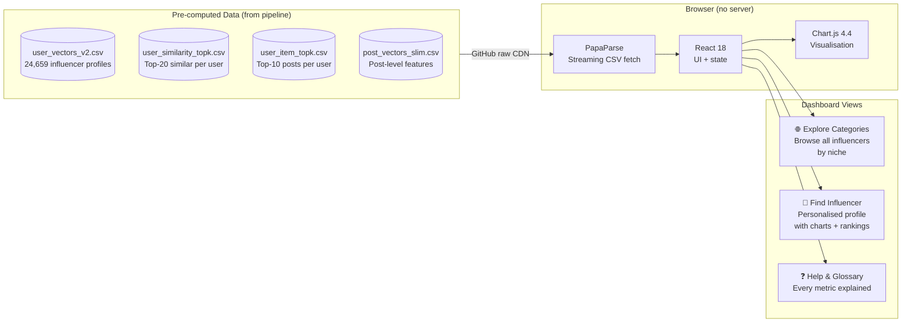

# Instagram Influencer Analytics - Dashboard

**CS5246 Text Mining - Group 25**
National University of Singapore

A fully static, zero-backend analytics dashboard for exploring Instagram influencer profiles, audience sentiment, and content similarity across 24,659 influencers.

**Live:** [Deployed on Netlify](https://enchanting-cascaron-69d520.netlify.app/) · **Pipeline repo:** [Instagram_sentiment_analyser](https://github.com/khushali259/Instagram_sentiment_analyser)

---

## What This Dashboard Does



The browser fetches all four CSV files from GitHub on first load (~92 MB total), caches them, and renders everything client-side. No server, no API, no database - everything was pre-computed by the [analytics pipeline](https://github.com/your-org/Instagram_sentiment_analyser).

---

## Repository Structure

```
instagram-influencer-dashboard/
├── index.html          # Entire dashboard — single self-contained file
└── data/
    ├── user_vectors_v2.csv          # 24,659 rows — influencer profiles
    ├── user_similarity_topk.csv     # Top-20 similar influencers per user
    ├── user_item_topk.csv           # Top-10 relevant posts per user
    └── post_vectors_slim.csv        # Post-level features (slim version)
```

Everything lives in `index.html`. No build step, no `node_modules`, no bundler.

---

## How to Run Locally

Since it's a static file, just open it:

```bash
# Option 1 — direct open (works for most things, CSV fetch may be blocked by browser CORS)
open index.html

# Option 2 — local server (recommended, avoids CORS issues with CSV fetching)
python3 -m http.server 8080
# then open http://localhost:8080 in your browser

# Option 3 — VS Code Live Server extension
# Right-click index.html → "Open with Live Server"
```

---

## How to Deploy (Netlify)

1. Push this repo to GitHub (keep it public so the CSV files are accessible)
2. Go to [netlify.com](https://netlify.com) → New site from Git
3. Select your repo → Build command: *(leave empty)* → Publish directory: `.`
4. Deploy - Netlify auto-deploys on every push to main

The dashboard auto-redeploys whenever you push updated CSV files. No configuration needed.

---

## Data Files

All four CSV files are produced by the [analytics pipeline](https://github.com/your-org/Instagram_sentiment_analyser) and must be placed in `data/`.

| File | Size | Rows | Description |
|------|------|------|-------------|
| `user_vectors_v2.csv` | ~13 MB | 24,659 | One row per influencer. Contains follower count, avg likes, avg comments, sentiment percentages, caption style features, NER entities, category, dominant sentiment. |
| `user_similarity_topk.csv` | ~18 MB | ~485,000 | Top-20 most similar influencers per user (within same category). Columns: `user`, `rank`, `similar_user`, `score`. |
| `user_item_topk.csv` | ~41.5 MB | ~242,000 | Top-10 most thematically relevant posts per user (from other influencers). Columns: `user`, `rank`, `post_id`, `post_owner`, `score`, `like_count`, `pct_positive_predicted`, `caption_preview`. |
| `post_vectors_slim.csv` | ~20 MB | 45,564 | Post-level aggregated features (slim version — large columns removed). |

### Key columns in `user_vectors_v2.csv`

| Column | Description |
|--------|-------------|
| `account_username` | Instagram handle (lowercase) |
| `followers` | Follower count |
| `posts_total` | Total posts on Instagram |
| `num_posts_in_dataset` | Posts present in our 2013–2019 dataset |
| `category` | Niche: beauty, family, fashion, fitness, food, interior, other, pet, travel |
| `avg_like_count` | Mean likes per post |
| `max_like_count` | Peak likes (single best post) |
| `avg_comment_count` | Mean comments per post |
| `avg_pct_positive_predicted` | Fraction of comments predicted Positive (0–1) |
| `avg_pct_neutral_predicted` | Fraction of comments predicted Neutral (0–1) |
| `avg_pct_negative_predicted` | Fraction of comments predicted Negative (0–1) |
| `user_dominant_sentiment` | Most frequent sentiment class across all posts |
| `avg_cap_num_hashtags` | Average hashtags per caption |
| `avg_cap_char_len` | Average caption character length |
| `avg_cap_vader_compound` | Average caption sentiment (VADER, −1 to +1) |
| `avg_cap_tb_subjectivity` | Average caption subjectivity (TextBlob, 0–1) |
| `account_is_verified` | `True` / `False` |

---

## Dashboard Features

### 🌐 Explore Categories
Browse all influencers within a selected niche (beauty, family, fashion, fitness, food, interior, other, pet, travel).

- **Summary metric cards** - category-wide averages for likes, comments, hashtags, and sentiment percentages
- **Follower vs engagement scatter** - log-log scale, coloured by dominant audience sentiment. Influencers in the top-left have high engagement relative to their follower count
- **Audience mood bar chart** - top 15 by likes, VADER sentiment score per bar. Shows that high likes ≠ happy audience
- **Positive sentiment histogram** - distribution of % positive across the category
- **Category sentiment donut** - overall positive/neutral/negative split
- **Sortable influencer table** - top-K (adjustable 5-50) with all key metrics. Click any row to open that influencer's full profile

### 👤 Find Influencer (Profile Search)
Type any username in the sidebar and click **View Profile**.

**If found:**
- Profile card with tier badge, follower count, category, verification status, posts in dataset
- 8 summary metric cards (followers, avg likes, peak likes, avg comments, hashtags, % positive/neutral/negative)
- Audience sentiment donut
- Caption style horizontal bar vs category average (6 dimensions)
- Scatter plot with this influencer highlighted (★)
- Positive sentiment histogram with this influencer highlighted in green
- **Top-20 similar influencers** - ranked by topic similarity score (not popularity)
- **Top-10 recommended posts** - most thematically relevant posts from other creators

**If not found:**
- Clear "not found" message explaining the dataset scope (2013–2019)
- Fallback to general category overview for the selected category

### ❓ Help & Glossary
Plain-English explanation of every metric, every chart type, and the classifier. Written to be understandable without any ML background.

Each chart card in the dashboard has an **ⓘ** button that jumps directly to the relevant glossary entry.

---

## Similarity Scoring

### User-User Similarity
How similar two influencers are in content topics, constrained to the same category.

```
score = 0.60 × TF-IDF cosine similarity (raw captions)
      + 0.30 × NER Jaccard overlap (shared PERSON/ORG/GPE/LOC mentions)
      + 0.10 × audience tone alignment (1 − |pct_pos_i − pct_pos_j|)
```

**Why raw captions?** Hashtags (#fashion, #ootd, #sustainablefashion) are the most consistent shared vocabulary on Instagram. Cleaning collapses them to plain words, which TF-IDF then downweights. Raw captions keep #sustainablefashion as a distinct, informative term.

Typical scores for the most similar pairs: **0.33-0.55**. These are moderate values - expected and meaningful for short social media text where two influencers might share 8-12 meaningful words per caption.

### User-Item Similarity
How relevant a post is to a searched influencer's content themes.

```
score = 0.60 × TF-IDF cosine similarity (caption vocabulary)
      + 0.40 × NER Jaccard overlap (shared entity mentions)
```

Engagement (likes, followers) is **intentionally excluded**. A 200-like post on the exact same topic scores higher than a 3M-like post on an unrelated topic. This reflects the distinction between **reach** and **relevance**.

---

## Influencer Tiers

Industry-standard classification based on follower count, permanently visible in the sidebar:

| Tier | Followers | Badge |
|------|-----------|-------|
| Nano | < 10,000 | Grey |
| Micro | 10K – 100K | Green |
| Macro | 100K – 1M | Purple |
| Mega | > 1M | Gold |

Nano and Micro influencers often have **higher engagement rates per follower** despite smaller reach - the dashboard surfaces this through the scatter chart.

---

## Tech Stack

| Component | Library | Version | Loaded via |
|-----------|---------|---------|------------|
| UI framework | React | 18.2.0 | CDN |
| JSX transpiler | Babel Standalone | 7.23.2 | CDN |
| CSV parsing | PapaParse | 5.4.1 | CDN |
| Charts | Chart.js | 4.4.0 | CDN |
| Fonts | Google Fonts (Syne + DM Sans) | — | CDN |
| Hosting | Netlify | — | Free tier |

Zero npm dependencies. Zero build step. The entire application is one HTML file.

---

## Classifier Details (from pipeline)

The sentiment labels displayed in the dashboard are predicted by a **Linear SVM** trained in the analytics pipeline:

| Metric | Value |
|--------|-------|
| Best model | Linear SVM (C=0.1) |
| CV F1 Macro | 0.8355 (5-fold) |
| Test F1 Macro | 0.7695 |
| F1 Negative | 0.5655 |
| Accuracy | 90.2% |
| RoBERTa agreement | 89.3% across 645,481 comments |

Key improvements over baseline:
- SMOTE oversampling (Negative class: 13K → 39K synthetic training samples)
- Character n-gram TF-IDF (3–5 grams, handles Instagram spelling variations)
- Prediction threshold tuning (NEG_THRESHOLD = 0.30 for better Negative recall)
- Expanded negative lexicon (`cmt_has_disappoint`: overrated, underwhelming, mediocre, etc.)
- Post-level train/test split (prevents data leakage from shared captions)

---

## Key Analytical Findings

The dashboard surfaces several non-obvious findings from the data:

1. **High reach ≠ positive sentiment** - Top-tier (Mega) influencers frequently have lower audience positivity than mid-tier (Micro/Macro) influencers in the same category. Larger audiences are more diverse and more critical.

2. **Multilingual clustering is emergent** - Spanish-language fashion influencers cluster together in similarity results because TF-IDF on raw captions captures shared Spanish vocabulary (*tendencias, accesorios, camisa, shein*). No language metadata was given to the algorithm.

3. **Category sentiment profiles differ systematically** - Fitness and food audiences tend toward higher positive ratios; interior design audiences ask more factual questions (higher Neutral); fashion audiences show more mixed sentiment.

4. **Caption style separates niches** - Interior design influencers write significantly longer captions; fashion influencers use more hashtags for discovery; travel influencers use more GPE (geographic) entities.

---

## Why Static Architecture

The dataset is historical and fixed (2013-2019). No new data arrives. All 645,481 comments have been classified offline. All similarity scores are pre-computed. The dashboard is a query interface over stored results - the standard **offline batch recommendation architecture** used in production for non-real-time workloads.

A live model API would only be necessary for:
- Classifying new comments in real time
- Computing similarity for influencers outside the dataset
- Continuously updating data

None of these conditions apply. The offline architecture **eliminates infrastructure cost, removes latency, and makes the system fully reproducible**.

---

## Team

**Team 25 - Group Name**
CS5246 Text Mining, National University of Singapore

| Member | Contributions |
|--------|---------------|
| Khushali Anil Patel | Dashboard architecture (React + Chart.js), Netlify deployment, similarity engine (TF-IDF cosine + NER Jaccard), user-level aggregation, EDA, report writing |
| Rayaan Nabi Ahmed Quraishi | Sentiment classification (Linear SVM, SMOTE, char n-grams, threshold tuning), feature engineering (55 features), SLURM cluster execution, report writing |
| Aviral Goyal | Exploratory data analysis, data visualisations, post-level aggregation, text preprocessing, report writing |
| Lim Charles Andrew | Result interpretation, evaluation framework design, literature review, report writing and editing |
| Chaitanya Kaushal | Project ideation, logical analysis of methodology, text preprocessing, spaCy NER extraction (PERSON/ORG/GPE/LOC), data cleaning, report coordination |
